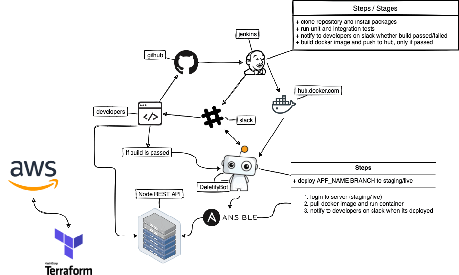

# Per Scholas Toolkit

The project's goal is to provide a ready-made, easily-modifiable DevOps toolkit in a Docker container. The container toolkit includes the latest copy of per scholas application,  and the most common DevOps tools frequently used with Jenkins. These DevOps tools include Git, AWS CLI, Terraform, Python, Docker, Docker Compose, Ansible and Kubernetes. The container is designed to be a long-lived, stood up, used for CI/CD, and torn down, and is ideal for the Cloud.




The `Per Scholas Toolkit` image is based on the latest [`abdallauno1/perscholas:v1`](https://hub.docker.com/repository/docker/abdallauno1/perscholas) Docker image. The Per Scholas Docker image is based on [python](https://www.python.org/).

## Installed Tools

- [Jenkins](https://www.jenkins.io/) v2.319.2
- [AWS CLI](https://aws.amazon.com/cli/) v1.15.4
- [Docker CE](https://docker.com/) v18.03.0-ce
- [Docker Compose](https://docs.docker.com/compose/) v1.21.0
- [Git](https://git-scm.com/) v2.11.0
- [HashiCorp Terraform](https://www.terraform.io/) v0.11.7
- [Jenkins](https://jenkins.io/) v2.116
- [pip3](https://pip.pypa.io/en/stable/#) v9.0.1
- [Python3](https://www.python.org/) v3.5.3
- [Ansible](https://www.ansible.com/) v2.11.8
- [Vagrant](https://www.vagrantup.com/) v2.2.19
- [Heroku](https://id.heroku.com/login) v8.0.0

Built Output

```text
*** INSTALLED SOFTWARE VERSIONS ***

PRETTY_NAME="Debian GNU/Linux 9 (stretch)"
NAME="Debian GNU/Linux"
VERSION_ID="9"
VERSION="9 (stretch)"
ID=debian
HOME_URL="https://www.debian.org/"
SUPPORT_URL="https://www.debian.org/support"
BUG_REPORT_URL="https://bugs.debian.org/"

Python 3.5.3
Docker version 18.03.0-ce, build 0520e24
docker-compose version 1.21.0, build 5920eb0
docker-py version: 3.2.1
git version 2.11.0
pip 9.0.1 from /usr/lib/python3/dist-packages (python 3.5)
aws-cli/1.15.4 Python/3.5.3 Linux/4.9.87-linuxkit-aufs botocore/1.10.4
Terraform v0.11.7
Ansible v2.11.8
Vagrant v2.2.19
Heroku v8.0.0
```

## Architecture

The Jenkins DevOps Toolkit Docker container uses two bind-mounted directories on the host. The first, the Jenkins' home directory, contains all required configuration. The second directory is used for backups, created using the Jenkins Backup plugin. Additionally, Jenkins can back up its configuration, using the SCM Sync plugin, to GitHub. Both these backup methods require additional configuration.


## Quick Start

Don't want to read the instructions?

```bash
sh ./install.sh
```

Jenkins will be running on [`http://localhost:8080`](http://localhost:8080).

## Optional: Adding Jenkins Plugins

The `Dockerfile` loads plugins from the `plugin.txt`. Currently, it installs two backup plugins. You can add more plugins to this file, before building Docker image. See the Jenkins [Plugins Index](https://plugins.jenkins.io/) for more.

Built Output

```text
Downloading thinBackup:1.9
Downloading backup:1.6.1
---------------------------------------------------
INFO: Successfully installed 2 plugins.
---------------------------------------------------
```

## Optional: Create Docker Image

The latest `abdallauno1/perscholas` image is available on [Docker Hub](https://hub.docker.com/r/garystafford/jenkins-devops/).

Optionally, to create a new image from the Dockerfile

```bash
docker build -t abdallauno1/perscholas:v1 .
```

## Run the Container

Create a new container from `abdallauno1/perscholas:v1` image

```bash
sh ./install.sh
```

## SCM

Install the SCM Sync Configuration Plugin (`scm-sync-configuration:0.0.10`)

Set git/GitHub repo path to your config repo, for example: `https://<personal_access_token>@github.com/<your_username>/perscholas.git`


## Troubleshooting

Fix time skew with container time:

```bash
docker run -it --rm --privileged \
  --pid=host debian nsenter -t 1 -m -u -n -i \
  date -u $(date -u +%m%d%H%M%Y)
```

## Further Development

To modify, build, and test locally, replacing my Docker Hub repo name switch your own:

```bash
# build
docker build --no-cache -t abdallauno1/perscholas:v1 .

# run temp copy only
docker run -d --name perscholas-container -p 4000:5000/tcp abdallauno1/perscholas:v1

# push
docker push abdallauno1/perscholas:v1

# clean up container and local bind-mounted directory
rm -rf ~/jenkins_home
docker rm -f devopstack_jenkins-devops_1
```
##  Test Environment

- [Jenkinsfile_test](Jenkinsfile_test)
- [playbook](playbook.yml)
- [hosts](hosts)
- [Dockerfile](Dockerfile)
## PROD Environment

- [Jenkinsfile](Jenkinsfile)
- [Dockerfile](Dockerfile)
- [heroku](Procfile)
- [Terraform](main.tf)
